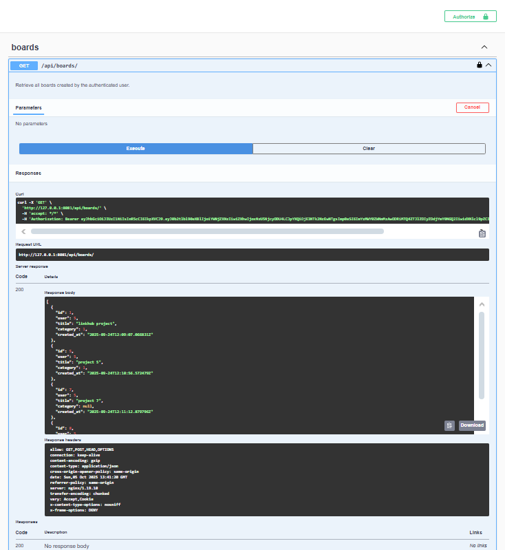

# Task Management API

This project is a **Task Management System** built with **Django Rest Framework (DRF)**.  
It provides user authentication with JWT and allows users to create and manage categories, boards, and tasks.  
The project also includes API documentation, logging, rate limiting, and testing.

<div align="center">
  
</div>

## Features

- **User Authentication**
  - User registration, login, and logout using JWT authentication.

- **Task Management**
  - Create, retrieve, update, and delete categories.
  - Create, retrieve, update, and delete boards.
  - Create, retrieve, update, and delete tasks.

- **Security and Rate Limiting**
  - Configured **DRF Throttling** to handle request rate limiting.

- **Logging**
  - Uses Django’s built-in logging system to track application activity.

- **API Documentation**
  - Integrated with **drf-spectacular** for OpenAPI/Swagger documentation.

- **Testing**
  - Includes unit tests using Django’s built-in test framework.

## Technologies Used

- **Backend**: Django, Django Rest Framework (DRF)
- **Authentication**: JWT (JSON Web Token)
- **Database**: MySQL
- **Containerization**: Docker
- **Web Server**: Nginx
- **Documentation**: drf-spectacular
- **Language**: Python

## Installation

1. Clone the repository:
   ```bash
   git clone https://github.com/Esmat434/Task_Management.git
   cd Task_Management
   ```

2. Create log file:
   ```bash
   mkdir logs
   ```

3. Copy .env.example to .env file:
   ```bash
   cp .env.example .env
   ```

4. Build Docker containers:
   ```bash
   docker-compose build 
   ```

5. start the Docker containers:
   ```bash
   docker-compose up -d
   ```

6. Create a superuser (optional):
 ```bash
 docker exec -it task_management python manage.py createsuperuser
 ```

## API Documentation

Once the server is running, the API documentation is available at:

```
http://localhost:8081/api/docs/swagger/
```

or

```
http://localhost:80801/api/docs/redoc/
```

## License

This project is licensed under the MIT License.
